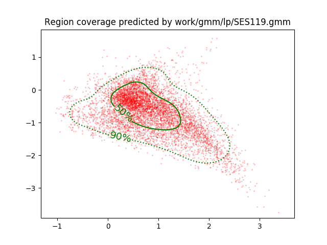
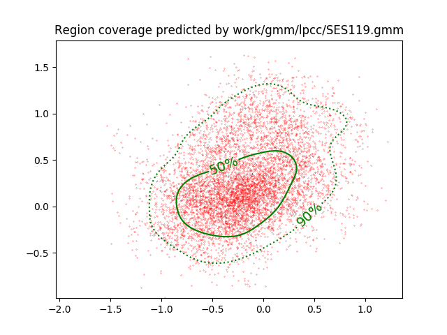
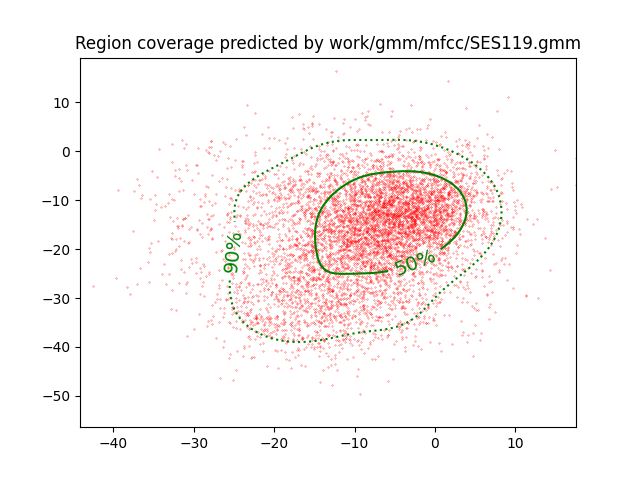
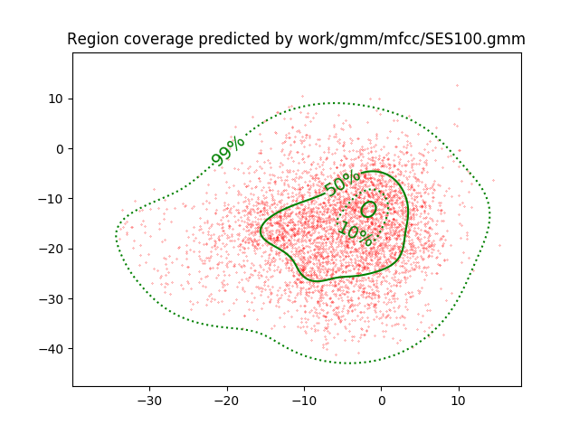
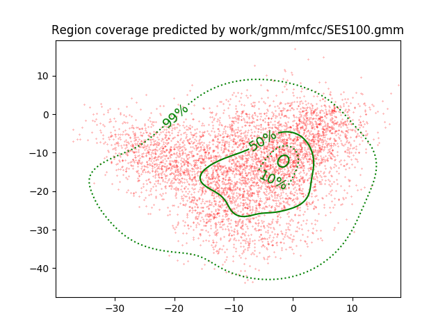

PAV - P4: reconocimiento y verificación del locutor
===================================================

Obtenga su copia del repositorio de la práctica accediendo a [Práctica 4](https://github.com/albino-pav/P4)
y pulsando sobre el botón `Fork` situado en la esquina superior derecha. A continuación, siga las
instrucciones de la [Práctica 2](https://github.com/albino-pav/P2) para crear una rama con el apellido de
los integrantes del grupo de prácticas, dar de alta al resto de integrantes como colaboradores del proyecto
y crear la copias locales del repositorio.

También debe descomprimir, en el directorio `PAV/P4`, el fichero [db_8mu.tgz](https://atenea.upc.edu/mod/resource/view.php?id=3654387?forcedownload=1)
con la base de datos oral que se utilizará en la parte experimental de la práctica.

Como entrega deberá realizar un *pull request* con el contenido de su copia del repositorio. Recuerde
que los ficheros entregados deberán estar en condiciones de ser ejecutados con sólo ejecutar:

~~~~~~~~~~~~~~~~~~~~~~~~~~~~~~~~~~~~~~~~~~~~~~~~~~~~~.sh
  make release
  run_spkid mfcc train test classerr verify verifyerr
~~~~~~~~~~~~~~~~~~~~~~~~~~~~~~~~~~~~~~~~~~~~~~~~~~~~~

Recuerde que, además de los trabajos indicados en esta parte básica, también deberá realizar un proyecto
de ampliación, del cual deberá subir una memoria explicativa a Atenea y los ficheros correspondientes al
repositorio de la práctica.

A modo de memoria de la parte básica, complete, en este mismo documento y usando el formato *markdown*, los
ejercicios indicados.

## Ejercicios.

### SPTK, Sox y los scripts de extracción de características.

- Analice el script `wav2lp.sh` y explique la misión de los distintos comandos involucrados en el *pipeline*
  principal (`sox`, `$X2X`, `$FRAME`, `$WINDOW` y `$LPC`). Explique el significado de cada una de las 
  opciones empleadas y de sus valores.

  * **SoX (Sound eXchange, the Swiss Army knife of audio manipulation)** sirve para realizar múltiples tareas con ficheros de audio. Algunas de sus funciones son:
    - Pasar de un formato de señal o fichero a otro.
    - Realizar algunas operaciones de procesado de señal (transformadas, reducción de ruido).
    - Reducción de ruido.
    
    En nuestro caso utilizamos esta herramienta para extraer las características (coeficientes).
  * **$X2X** permite la conversión entre distintos formatos de datos. En nuestro caso pasamos de un signed integer de 16 bits a short float y de float a ascii para guardar en un fichero la fmatrix.
  * **$FRAME** extrae frame a frame toda una secuencia. En nuestro caso se cogen tramas de longitud 240 (`-l 240`) con un periodo 80 (`-p 80`). Hay superposición entre tramas.
  * **$WINDOW** enventana los datos. Como no especificamos el tipo de ventana, se utiliza Blackman. En nuestro caso, los datos de entrada tienen una longitud de 240 (`-l 240`) y una longitud de los datos de salida de 240 (`-L 240`).
  * **$LPC** calcula los coeficientes LPC utilizando el método de Levinson-Durbin. Se utilizan los parámetros -l  que indica la longitud de la frame (`-l 240`) y `-m` que indica el orden del LPC.


- Explique el procedimiento seguido para obtener un fichero de formato *fmatrix* a partir de los ficheros de
  salida de SPTK (líneas 45 a 47 del script `wav2lp.sh`).

  ```bash
  ncol=$((lpc_order+1)) # lpc p =>  (gain a1 a2 ... ap) 
  nrow=`$X2X +fa < $base.lp | wc -l | perl -ne 'print $_/'$ncol', "\n";'`
  ```

  El fmatrix crea una matriz que incluye el número de filas (`nrow`) y todos los coeficientes (`ncol`). Las filas corresponden a las tramas de la señal y las columnas a los coeficientes de cada trama. 
  
  El número de columnas se calcula como el número de coeficientes del orden del predictor lineal más uno, puesto que en el primer elemento se almacena la ganancia de predicción.
  
  Para obtener el número de filas se convierte la señal parametrizada a texto, mediante `$X2X`. A continuación se cuentan las filas utilizando `wc -l`.  Por último, utilizando un comando perl introduce una línea (`-e`) de manera repetida (`-n`).

  * ¿Por qué es más conveniente el formato *fmatrix* que el SPTK?

  Porque permite tener los datos de forma ordenada, haciendo más fácil el acceso a ellos.

- Escriba el *pipeline* principal usado para calcular los coeficientes cepstrales de predicción lineal
  (LPCC) en su fichero <code>scripts/wav2lpcc.sh</code>:

  ```bash
  sox $inputfile -t raw -e signed -b 16 - | $X2X +sf | $FRAME -l 240 -p 80 | $WINDOW -l 240 -L 240 | $LPC -l 240 -m $lpc_order | $LPCC -m $lpc_order -M $lpcc_order > $base.lp
  ```

- Escriba el *pipeline* principal usado para calcular los coeficientes cepstrales en escala Mel (MFCC) en su
  fichero <code>scripts/wav2mfcc.sh</code>:

  ```bash
  sox $inputfile -t raw -e signed -b 16 - | $X2X +sf | $FRAME -l 240 -p 80 | $WINDOW -l 240 -L 240 | $MFCC -l 240 -s 8 -m $mfcc_order -n $mfcc_nfilter > $base.mfcc
  ```

### Extracción de características.

- Inserte una imagen mostrando la dependencia entre los coeficientes 2 y 3 de las tres parametrizaciones
  para todas las señales de un locutor.
  
  + Indique **todas** las órdenes necesarias para obtener las gráficas a partir de las señales 
    parametrizadas.


    - LP
      
      `plot_gmm_feat -x 2 -y 3 -g green work/gmm/lp/SES119.gmm work/lp/BLOCK11/SES119/SA119S*`
    - LPCC
      
      `plot_gmm_feat -x 2 -y 3 -g green work/gmm/lpcc/SES119.gmm work/lpcc/BLOCK11/SES119/SA119S*`
    - MFCC
      
      `plot_gmm_feat -x 2 -y 3 -g green work/gmm/mfcc/SES119.gmm work/mfcc/BLOCK11/SES119/SA119S*`

  + ¿Cuál de ellas le parece que contiene más información?
  
    La propiedad de correlación indica el parecido entre dos señales. Cuanto más correladas estén, menos información nueva aportarán. Como puede apreciarse en las gráficas superiores, las gráficas de MFCC y LPCC son las que tienen los puntos más separados, es decir, las más incorreladas. Por ello, serán las que aporten más información. En último lugar, la que aporta menos información es la de LP.

- Usando el programa <code>pearson</code>, obtenga los coeficientes de correlación normalizada entre los
  parámetros 2 y 3 para un locutor, y rellene la tabla siguiente con los valores obtenidos.

  |                        | LP   | LPCC | MFCC |
  |------------------------|:----:|:----:|:----:|
  | &rho;<sub>x</sub>[2,3] | -0.84003 |0.307484 | -0.0289964 |
  
  + Compare los resultados de <code>pearson</code> con los obtenidos gráficamente.

    Los coeficientes obtenidos son coherentes con las gráficas calculadas anteriormente. Por una parte, el mayor coeficiente (en valor absoluto) se obtiene para el caso de LP, siendo este cercano a 1. Por otra parte, los coeficientes LPCC y MFCC tienen un valor mucho menor al de LP, lo que significa que estarán menos correlados y por tanto aportarán más información. Podemos concluir destacando que, como era de esperar, los MFCC son los más incorrelados, los que más información nos aportan.
  
- Según la teoría, ¿qué parámetros considera adecuados para el cálculo de los coeficientes LPCC y MFCC?

  De acuerdo con la teoría, para el cálculo de LPCC debería ser suficiente con 13 coeficientes, mientras que para MFCC se suelen escoger 13 coeficientes y entre 24 y 40 filtros.

### Entrenamiento y visualización de los GMM.

Complete el código necesario para entrenar modelos GMM.

- Inserte una gráfica que muestre la función de densidad de probabilidad modelada por el GMM de un locutor
  para sus dos primeros coeficientes de MFCC.

- Inserte una gráfica que permita comparar los modelos y poblaciones de dos locutores distintos (la gŕafica
  de la página 20 del enunciado puede servirle de referencia del resultado deseado). Analice la capacidad
  del modelado GMM para diferenciar las señales de uno y otro.

  Podemos observar que si el entrenamiento se hace correctamente, el modelo GMM se adapta perfectamente a la distribución de probabilidad.
  

  En cambio, si visualizamos un modelo GMM entrenado de un locutor con la distribución de probabilidad de los dos primeros coeficientes MFCC de otro locutor, se observa que no se adapta a la distribución de los datos. Por esto, el modelado GMM tiene la capacidad de diferenciar señales de uno u otro locutor.
  

### Reconocimiento del locutor.

Complete el código necesario para realizar reconociminto del locutor y optimice sus parámetros.

- Inserte una tabla con la tasa de error obtenida en el reconocimiento de los locutores de la base de datos
  SPEECON usando su mejor sistema de reconocimiento para los parámetros LP, LPCC y MFCC.

  |               | LP   | LPCC | MFCC |
  |---------------|:----:|:----:|:----:|
  | Tasa de error | 7.26% | 0.51% | 0.89% |

### Verificación del locutor.

Complete el código necesario para realizar verificación del locutor y optimice sus parámetros.

- Inserte una tabla con el *score* obtenido con su mejor sistema de verificación del locutor en la tarea
  de verificación de SPEECON. La tabla debe incluir el umbral óptimo, el número de falsas alarmas y de
  pérdidas, y el score obtenido usando la parametrización que mejor resultado le hubiera dado en la tarea
  de reconocimiento.

  |                 | LP | LPCC | MFCC |
  |-----------------|:----:|:----:|:----:|
  | Umbral óptimo   | 0.373737057570103 | 0.276933713207707 | 0.383636495059995 |
  | Pérdidas        | 73/250 = 0.2920 | 7/250 = 0.0280 | 15/250 = 0.0600 |
  | Falsas Alarmas  | 13/1000 = 0.0170 | 1/1000 = 0.0010 | 9/1000 = 0.0090|
  | Cost Detection  | 44.5 | 3.7 | 8.6 |
 
### Test final

- Adjunte, en el repositorio de la práctica, los ficheros `class_test.log` y `verif_test.log` 
  correspondientes a la evaluación *ciega* final.

### Trabajo de ampliación.

- Recuerde enviar a Atenea un fichero en formato zip o tgz con la memoria (en formato PDF) con el trabajo 
  realizado como ampliación, así como los ficheros `class_ampl.log` y/o `verif_ampl.log`, obtenidos como 
  resultado del mismo.
